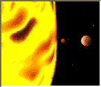

# area

> area 标签定义图像映射内部的区域。

语法：

```html


<map name="planetmap">
    <area shape="rect" coords="0,0,82,126" href="planetmap_sun.gif">
    <area shape="circle" coords="90,58,3" href="planetmap_merglobe.gif">
    <area shape="circle" coords="124,58,8" href="planetmap_venglobe.gif">
</map>
```

效果：


<map name="planetmap">
    <area shape="rect" coords="0,0,82,126" href="planetmap_sun.gif">
    <area shape="circle" coords="90,58,3" href="planetmap_merglobe.gif">
    <area shape="circle" coords="124,58,8" href="planetmap_venglobe.gif">
</map>